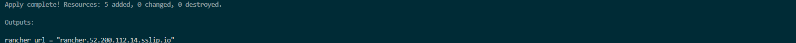

# Rancher en 10 minutos

# Fácil instalación de RKE2, Rancher Manager, Longhorn y Neuvector

### Tabla de contenidos

- [Acerca de mí](#Acerca-de-mí)
- [Introducción](#Introducción)
- [Prerrequisitos](#Prerrequisitos)
- [Observa el video](#Observa-el-video)
- [Preparando las credenciales de AWS](#Preparando-las-credenciales-de-AWS)
- [Aprovisionamiento con Terraform](#Aprovisionamiento-con-Terraform)
- [Rancher Multi Cluster Manager](#Rancher-multi-cluster-manager)
- [Destrucción del ambiente](#Destrucción-del-ambiente)
- [Conclusión](#Conclusión)

## Acerca de mí

Un poco de mi historia...

- Solution Architect para SUSE Mexico
- He trabajado en el area de preventa por más de 8 años
- Conocimiento en el area de on-premise, nube y ahora nube nativa
- Gamer de nacimiento, me encanta jugar muchos juegos de los 90s!

## Introducción

### Bienvenido a la Guía de Rancher en 10 minutos

En esta guía de despliegue, instalaremos SUSE Rancher, que incluye los siguientes productos:

- RKE2 (Distribución de Kubernetes) - [Click aquí para conocer más](https://ranchergovernment.com/products/rke2)
- Rancher Manager (Administración de Clústeres) - [Click aquí para conocer más](https://ranchergovernment.com/products/mcm)


### Prerrequisitos

1. Cuenta de AWS
2. Crear una credencial Access Key con facultades de Administrador
3. Instancia de EC2, o VM de Linux con Terraform instalado
4. Este repositorio clonado

## Observa el video

Si prefieres seguir esta guía con un increíble video... por favor, haz clic a continuación! (Pronto)

[![rancher-demo-aws]](images/rancher-demo-aws.png)

# Preparando las credenciales de AWS

Es necesario exportar las credenciales a variables hacia nuestro VM de desarrollo donde tenemos terraform instalado, esto con el fin de no "hard-cordearlas" en el código por seguridad, ejecutaremos los siguientes comandos de acuerdo a tus credenciales:

```bash
# Exportar las credenciales AWS a variables
export AWS_ACCESS_KEY_ID=tu-access-key-id
export AWS_SECRET_ACCESS_KEY=tu-secret-access-key
export AWS_SESSION_TOKEN=tu-session-token # Solamente si usas credenciales temporales
```

## Aprovisionamiento con Terraform

Para este despliegue, utilizaremos un servidor SLES 15 SP5 virtualizado aprovisionado por AWS y Terraform. Cualquier distribución de Linux debería funcionar perfectamente, siempre que haya conectividad de red. Aquí tienes una lista de nuestros [Sistemas Operativos soportados](https://docs.rke2.io/install/requirements#operating-systems). 

Ejecutaremos los siguientes comandos en nuestra instancia o VM de linux con Terraform Instalado.

```bash
# Desplegar Rancher en 10 minutos
terraform init
terrafom plan
terraform apply auto-approve
```

## Rancher Multi Cluster Manager

Cuando ejecutamos el script de Terraform, en justamente 10 minutos, podremos visualizar la liga a la que debemos visitar para entrar a nuestro portal de Rancher:



Ahora debería visualizar Rancher Manager solicitando una contraseña que configuramos durante la instalación. Para mi implementación utilicé `rancherSecurePassword`. También deberás verificar la URL de Rancher Manager y aceptar los Términos y condiciones. Una vez completado... Debería verse así:


Ahora tienes Rancher Manager implementado con éxito en un clúster RKE2 Kubernetes!!! Recuerda que hay muchas formas de configurarlo y esta fue solo una instalación mínima y sencilla. Siéntete libre de explorar todo lo que puedes hacer dentro de Rancher Manager, en este caso podemos pasaremos al siguiente paso de instalar Rancher Longhorn.

## Destrucción del ambiente

Si ya has explorado suficiente y deseas dejar de practicar en tu Rancher Manager Server, ejecutaremos los siguientes comandos en nuestra instancia o VM de desarrollo con Terraform Instalado.

```bash
# Destruir ambiente
terraform destroy -auto-approve
```


## Conclusión

En unos sencillos pasos y exactamente 10 minutos, pudimos implementar Rancher listo para usarse!

Si tienes algún problema con esta guía de implementación por favor, no dudes en comunicarte conmigo! Gracias, y hasta pronto!
